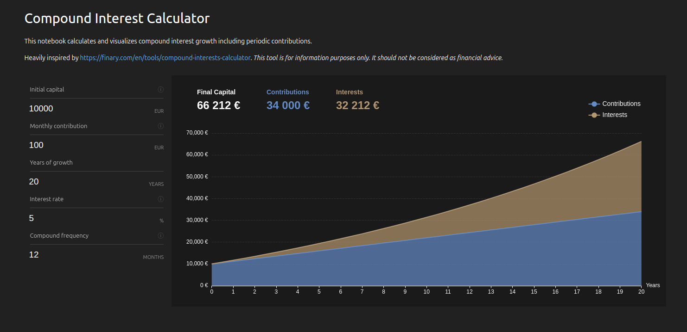

# Compound Interest Calculator

[](https://jtp.io/compound-interest-calculator/voici/render/app.html)

Calculate and visualize compound interest growth including periodic contributions.

*This tool is for information purposes only. It should not be considered as financial advice.*

## ✨ Try it in your browser ✨

https://jtpio.github.io/compound-interest-calculator/voici/render/app.html



## Run locally

It is also possible to run the app locally in JupyterLab and with Voila.

With [pixi](https://pixi.sh), open JupyterLab with:

```bash
pixi run jupyter lab content/app.ipynb
```

To render with Voila:

```bash
pixi run voila content/app.ipynb
```

## Acknowledgments

Design heavily inspired by https://finary.com/en/tools/compound-interests-calculator.

Built with [Jupyter Notebook](https://github.com/jupyter/notebook), [ipywidgets](https://github.com/jupyter-widgets/ipywidgets) and [ipecharts](https://github.com/trungleduc/ipecharts).
